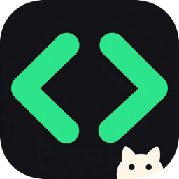

<p align="center">
  
</p>

<h1 align="center">JimiDeck</h1>

<p align="center">
  One launcher for your ChatGPT Desktop and Codex CLI profiles.
</p>

<p align="center">
  <a href="README.zh-CN.md">简体中文</a> ·
  <a href="https://deck.jimidou.com">Website</a> ·
  <a href="https://github.com/zybless/JimiDeck/releases">Releases</a>
</p>

<p align="center">
  <a href="https://github.com/zybless/JimiDeck/actions/workflows/ci.yml"></a>
  <a href="LICENSE"></a>
  
</p>

JimiDeck keeps multiple Codex contexts close at hand. Give each profile a clear name, open it from one window, and keep work, personal, and project state in separate local directories.

## Highlights

- Launch the default environment and named profiles from one place.
- Manage ChatGPT Desktop profiles on macOS and Codex CLI profiles on macOS and Windows.
- Import profiles created with `codex-profile` into the desktop app.
- Open CLI profiles in a selected or recently used project directory.
- Diagnose missing runtimes, invalid paths, and incomplete profiles before launch.
- Keep profile metadata on the local machine. JimiDeck has no account service and does not inspect authentication tokens.

## Platform support

| Capability | macOS 14+ | Windows 10/11 x64 |
| --- | --- | --- |
| ChatGPT Desktop profiles | Yes | Default profile only |
| Codex CLI profiles | Yes | Yes |
| Import existing `codex-profile` profiles | Yes | Planned |
| App UI | Native SwiftUI | Electron |

JimiDeck is currently alpha software. Windows support focuses on Codex CLI profiles because ChatGPT Desktop does not expose the same profile-directory launch mechanism there.

## Install

Download the latest artifact from the [release page](https://github.com/zybless/JimiDeck/releases) or the [JimiDeck website](https://deck.jimidou.com).

| Platform | Format | Use case |
| --- | --- | --- |
| macOS | `.dmg` | Standard installation |
| macOS | `.zip` | Portable archive |
| Windows | `.exe` | Standard installation |
| Windows | `.zip` | Portable archive |

Current alpha builds are unsigned. Verify the published SHA-256 checksum before opening a downloaded artifact.

## Build from source

### macOS

Requirements: Xcode 16 or later and [XcodeGen](https://github.com/yonaskolb/XcodeGen).

```bash
xcodegen generate
xcodebuild test \
  -project JimiDeck.xcodeproj \
  -scheme JimiDeck \
  -destination 'platform=macOS' \
  CODE_SIGNING_ALLOWED=NO
```

### Windows

Requirements: Node.js 22 LTS and npm.

```powershell
cd Windows
npm ci
npm run check
npm start
```

## How profile isolation works

Each named profile receives its own data directory. JimiDeck passes that directory to the compatible launcher and records only the metadata needed to display and reopen it. This separation prevents routine state mixing; it is not an operating-system security sandbox.

See [Architecture](ARCHITECTURE.md) for storage, launch, and deletion details.

## Contributing

Bug reports and focused pull requests are welcome. Start with [Contributing](CONTRIBUTING.md), review the [Code of Conduct](CODE_OF_CONDUCT.md), and report vulnerabilities through the process in [Security](SECURITY.md).

## License

JimiDeck is available under the [MIT License](LICENSE), including private and commercial use subject to its terms. The project name and logo are covered separately by the [trademark guidelines](TRADEMARKS.md). Bundled third-party components retain their own notices.

## Acknowledgements

The macOS compatibility layer builds on [`Ducksss/codex-profiles`](https://github.com/Ducksss/codex-profiles). Version and license details are recorded in [Third-Party Notices](THIRD_PARTY_NOTICES.md).
